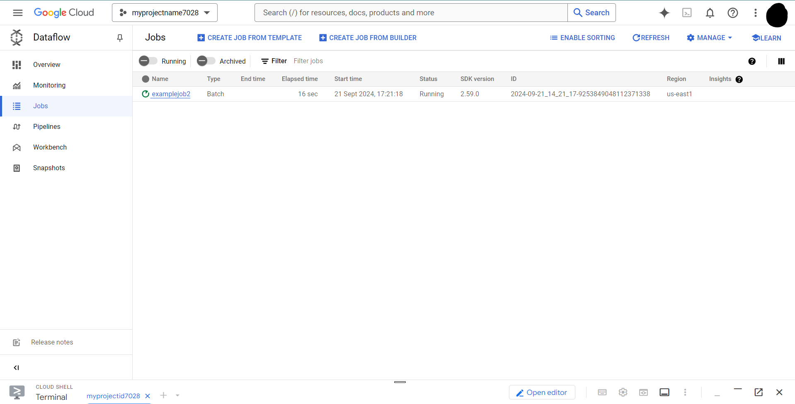
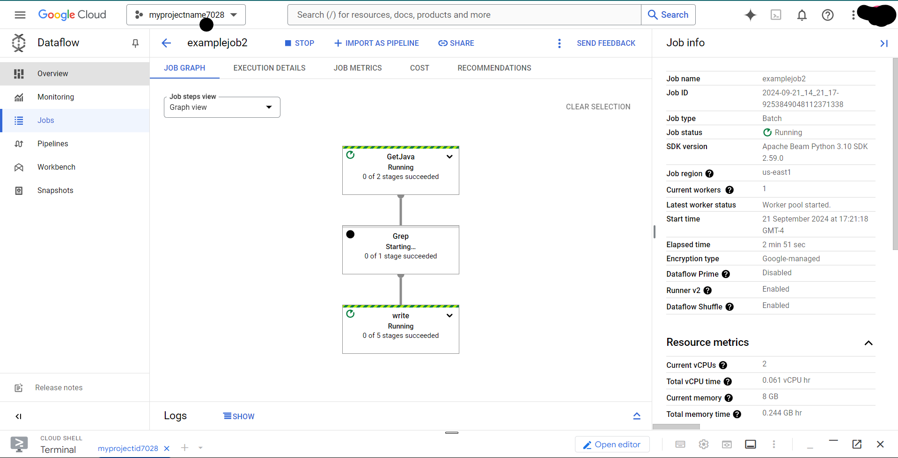

# Google Cloud Dataflow Pipeline (Python) 2.5

## Overview

Google Cloud Dataflow is a fully managed service for stream and batch data processing. It allows you to build scalable, distributed data processing pipelines. Dataflow is commonly used for real-time analytics, and more, particularly with Apache Beam as the underlying programming model.

In this project we will

1.  Open Dataflow project
2.  Pipeline filtering
3.  Execute the pipeline locally and on the cloud

## Objective

* Setup a Python Dataflow project using Apache Beam.
* Write a simple pipeline in Python.
* Execute the query on the local machine.
* Execute the query on the cloud.


## TASK 1 : SetUp

### Step 1: Authectication login

```bash
gcloud auth list
```
```bash
gcloud auth login
```
### Step 2: Setting up project
```
gcloud config get-value project

gcloud config set project myprojectid7028
```

<br>
<br>

## TASK 2 :  Enabling Dataflow API.

Code

```bash 
gcloud services disable dataflow.googleapis.com --force
gcloud services enable dataflow.googleapis.com
```
<br>
<br>

## TASK 3 :  Preparation

For this project we will use cloud shell machine as local machine.

### STEP 1 : Create a bucket 

```powershell
gcloud storage buckets create gs://myprojectid7028 --location=us-east1 --no-public-access-prevention
```

### STEP 2 : Setting up Bucket name 

```powershell
$BUCKET="myprojectid7028"
echo $BUCKET
```
<br>
<br>

## TASK 4 : Creating a pipeline filtering 

* About Dataset : We will be using **javahelp** dataset from google cloud training repo [Link](https://github.com/GoogleCloudPlatform/training-data-analyst)

   This dataset contain different java files 


### STEP 1: Download the files from github and keep it in a folder

File can found here : [Link](https://github.com/salman-shaikh7/Data-Analysis-with-Serverless-Dataflow-pipeline/tree/main/javahelp)

### STEP 2: Build pipeline code for local machine.

Python Code 

```python
import apache_beam as beam
import sys

def my_grep(line, term):
   if line.startswith(term):
      yield line

if __name__ == '__main__':
   p = beam.Pipeline(argv=sys.argv)
   input = 'javahelp\*.java'
   output_prefix = 'tmp\output'
   searchTerm = 'import'

   # find all lines that contain the searchTerm
   (p
      | 'GetJava' >> beam.io.ReadFromText(input)
      | 'Grep' >> beam.FlatMap(lambda line: my_grep(line, searchTerm) )
      | 'write' >> beam.io.WriteToText(output_prefix)
   )

   p.run().wait_until_finish()
```

This Apache Beam pipeline reads lines from multiple .java files, filters the lines that start with the word "import," and writes the filtered lines to an output file. 

The pipeline consists of three main steps:

*   ReadFromText: Reads all lines from the .java files.
*   FlatMap: Filters lines that start with "import."
*   WriteToText: Writes the filtered lines to a specified output location.

<br>
<br>

## TASK 5: Execute the pipeline locally


### STEP 1 : Create & activate a virtual enviornment 

```powershell
python -m venv myvirtualenv
```

```powershell
activate.ps1
```

### STEP 2 : Install required depedencies in virtual env

```python
pip install apache-beam[gcp]
```

### STEP 3 : Run pipeline

```powershell
python local_pipeline.py
```

After executing this pipeline we can see that we have file *tmp\output-00000-of-00001* contains required output.

<br>
<br>

## TASK 6: Execute the pipeline in gcp cloud.

### STEP 1 : Copy Local files to Cloud Storage bucket

```powershell

gcloud storage cp javahelp\*.java gs://$BUCKET/javahelp

```

### STEP 2 : Write new pipline with New variables

We are adding project id, region and bucket location path 

```python

import apache_beam as beam

def my_grep(line, term):
   if line.startswith(term):
      yield line

PROJECT='myprojectid7028'
BUCKET='myprojectid7028'
REGION='us-east1'

def run():
   argv = [
      '--project={0}'.format(PROJECT),
      '--job_name=examplejob2',
      '--save_main_session',
      '--staging_location=gs://{0}/staging/'.format(BUCKET),
      '--temp_location=gs://{0}/staging/'.format(BUCKET),
      '--region={0}'.format(REGION),
      '--worker_machine_type=e2-standard-2',
      '--runner=DataflowRunner'
   ]

   p = beam.Pipeline(argv=argv)
   input = 'gs://{0}/javahelp/*.java'.format(BUCKET)
   output_prefix = 'gs://{0}/javahelp/output'.format(BUCKET)
   searchTerm = 'import'

   # find all lines that contain the searchTerm
   (p
      | 'GetJava' >> beam.io.ReadFromText(input)
      | 'Grep' >> beam.FlatMap(lambda line: my_grep(line, searchTerm) )
      | 'write' >> beam.io.WriteToText(output_prefix)
   )

   p.run()

if __name__ == '__main__':
   run()

```
### STEP 3 : Run

```powershell
python cloud_pipeline.py
```

## STEP 4 : Check Job created or not



